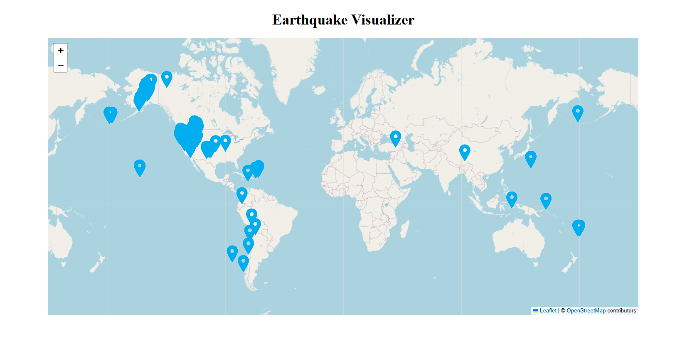

# 🌍 Earthquake Visualizer

An interactive web app that visualizes recent global earthquake activity using data from the [USGS Earthquake API](https://earthquake.usgs.gov/earthquakes/feed/v1.0/summary/all_day.geojson). This project provides a real-time overview of seismic patterns, allowing users to see earthquake locations, magnitudes, and details on a dynamic map.

## 🔥 Features

- **Real-Time Data**: Displays the latest earthquakes from around the world.
- **Interactive Map**: Zoom, pan, and click on markers for detailed earthquake information.
- **Data Customization**: Earthquake markers can vary in size and color based on magnitude.

## Preview 

### Home Screen



## 🛠️ Built With

- **Frontend**: React or Svelte (choose one)
- **Mapping Library**: [Leaflet](https://leafletjs.com/) with either [React-Leaflet](https://react-leaflet.js.org/) or [Svelte-Leaflet](https://github.com/davidedantonio/svelte-leaflet)

## 📡 API Used

- **USGS Earthquake API**: Provides up-to-date earthquake data in GeoJSON format.
  - Endpoint: `https://earthquake.usgs.gov/earthquakes/feed/v1.0/summary/all_day.geojson`

## 🚀 Getting Started

### Prerequisites

- Node.js and npm installed
- API and framework dependencies installed (e.g., `react-leaflet` for React projects)

### Installation

1. **Clone the repository**:
   ```bash
   git clone https://github.com/yourusername/earthquake-visualizer.git
   cd earthquake-visualizer
   npm run dev
